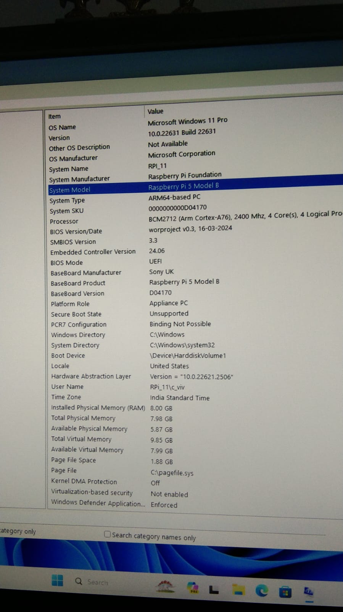

# Setting up a Raspberry Pi to run Windows 11 ARM version and stock T3000

## Introduction

This guide provides a step-by-step process to set up a Raspberry Pi to run Windows 11 and the official version of T3000. 

Although T3000 is officially supported only Win32/x64 versions of Windows, it can be run on Windows 11 ARM64, using the Prism emulation engine bundled with the ARM versions of Windows.

## Prerequisites

- A Raspberry Pi 4 Model B or later (Images here are from Raspberry Pi 5 8GB)
- A 16GB or larger microSD card
- Windows 11 ARM64
- T3000 software
- M.2 hat with a compatible NVMe SSD (Good to have since running Windows 11 ARM64 on a microSD card is painfully slow)
- A compatible power supply (I'm using the standard 27W charger from the PI foundation)

## Setting up the OS

As of today (2024-07-20) none of the Windows OS versions are officially supported on Raspberry Pi 5. Please refer to the following resources to get this working:
- WoR project (https://worproject.com/guides/how-to-install)
- First method documented in https://raspberrytips.com/windows-11-on-raspberry-pi/
- How to install Windows 11 on Raspberry Pi 5 (https://www.youtube.com/watch?v=haeYUq4RHbk)

## Installing T3000

Compared to the installation of Windows 11 ARM64 on Raspberry Pi 5, the installation of T3000 is straightforward. 

Just download the offical release from here (http://temcocontrols.com/ftp/software/T3000.zip), which is a self-extracting executable and run it.

